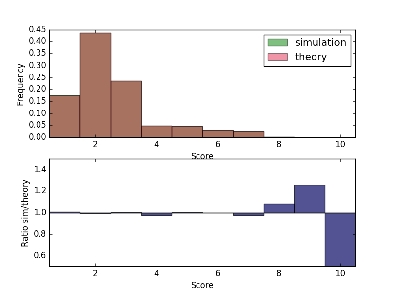

# Pokerly
Attempt at poker simulator

## Basic example

### Create the deck and shuffle
```
my_deck = Deck()
my_deck.shuffle()
```

### Create some players
```
names = ['Alice','Bob','Cthulhu']
players = []
for n in names:
  players.append(Player.Player(n))
```

### Deal cards to the players
```
for _ in range(Player.max_cards):
  for p in players:
    my_deck.deal_card(p)
```

### Deal the flop, river turn
```
my_pool = PokerPool('Common Pool')
for _ in range(PokerPool.max_cards):
  my_deck.deal(my_pool)
```

### Print the state of the deck
Print out deck, ordered by value and suit for debugging
```
print(my_deck)
```

### Print the table cards
List the flop, river, turn cards available to all players
```
print(my_pool)
```

### Print players hands
Print players name and two dealt cards. Afterwards, display the highest ranking hand using the community pool cards. Print the cards used to rank the hand, and the kickers if any.
```
for p in players:
  i_hand = PokerHand(p.hand, my_pool.hand)
  i_hand.get_score()
  print('{0} Score:{1}'.format(p, i_hand.score))
  print('  Final Hand: {0}'.format(i_hand.final_hand))
  print('  Rank cards: {0}'.format(i_hand.rank_cards))
  print('Kicker Cards: {0}'.format(i_hand.kicker_cards))
```

### Simulation compared to theory

